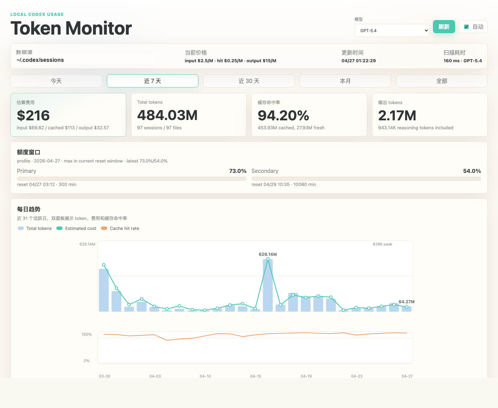
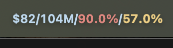

# Codex Token Monitor

一个本地运行的 Codex token 用量监控器，读取 `~/.codex/sessions` 里的 session JSONL，展示 token、缓存命中、估算费用和额度窗口。

它包含两部分：

- Web Dashboard：本地网页看长期趋势和明细
- macOS Menu Bar：顶部菜单栏显示今天的估算费用和 total tokens

所有数据默认只在本机读取和展示，HTTP 服务绑定在 `127.0.0.1`。

## 截图

### Dashboard



### macOS Menu Bar



## 功能

- 按今天、近 7 天、近 30 天、本月、全部统计 token
- 估算输入、缓存输入、输出 token 的费用
- 使用事件时间归因，避免按 session 创建日期误算每日用量
- 展示 cache hit rate、reasoning output tokens、活跃 session 数
- 展示 5h primary 和 7d secondary 额度窗口
- macOS 菜单栏实时显示今日估算费用、total tokens、5h 和 1w 用量
- 菜单栏 quota 文字按 5h primary / 1w secondary 使用率从薄荷绿渐变到玫红
- 支持 LaunchAgent，开机后自动启动 dashboard 和菜单栏

## 环境要求

- macOS
- Node.js 20+
- Codex session 文件位于 `~/.codex/sessions`

## 一键安装

```bash
git clone https://github.com/uohzey0519/codex-token-monitor.git
cd codex-token-monitor
npm run install:macos
```

打开 Dashboard：

```text
http://127.0.0.1:48731
```

安装脚本会写入两个 LaunchAgent：

- `ai.codex.token-monitor`：本地 HTTP dashboard/API
- `ai.codex.token-menubar`：macOS menu bar helper

## Menu Bar 显示

菜单栏默认显示：

```text
$今日估算费用 / 今日 total tokens / 5h primary 使用率 / 1w secondary 使用率
```

为了节省菜单栏空间，实际显示不会写出 `5h` 和 `1w` 标签，例如：

```text
$70/85.7M/84%/54%
```

其中第三段是 5h primary，第四段是 1w secondary。默认按 `gpt-5.5` 估算费用。前两段使用固定柔和蓝色，后两段分别按对应额度窗口变色：

```text
薄荷绿 -> 蜂蜜黄 -> 蜜桃橙 -> 玫红
```

如果想换成别的模型，例如 `gpt-5.4`：

```bash
CODEX_TOKEN_MENU_MODEL=gpt-5.4 npm run install:macos
```

## 配置

安装时会把这些环境变量写入 LaunchAgent：

```bash
HOST=127.0.0.1
PORT=48731
CODEX_SESSIONS_ROOT="$HOME/.codex/sessions"
CODEX_TOKEN_MENU_MODEL=gpt-5.5
```

例如换端口和菜单栏估算模型：

```bash
PORT=49888 CODEX_TOKEN_MENU_MODEL=gpt-5.4 npm run install:macos
```

## 常用命令

```bash
npm start                  # 前台运行 dashboard
npm run install:macos      # 安装并启动 LaunchAgents
npm run uninstall:macos    # 停止并移除 LaunchAgents
npm run status:macos       # 查看 LaunchAgent 状态
npm run check              # 检查 server 和 menu bar helper 语法
```

## 卸载

```bash
npm run uninstall:macos
```

卸载只会移除 LaunchAgent，不会删除你的 session 文件，也不会删除本仓库。

## 隐私说明

本工具读取本机 Codex session JSONL 文件，默认只启动绑定在 `127.0.0.1` 的本地 HTTP 服务，不会上传 session 数据。

费用只是估算值。当前实现使用 `server.js` 里的价格表，并按 session 中记录的输入、缓存输入、输出 token 计算；如果 session 没有精确模型信息，Dashboard 会使用你在界面中选择的模型估算。

## License

MIT
